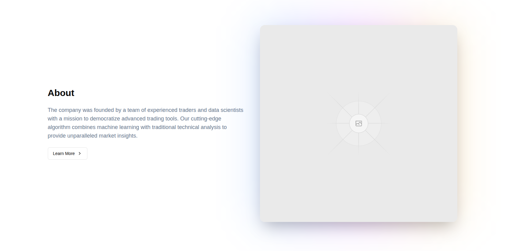
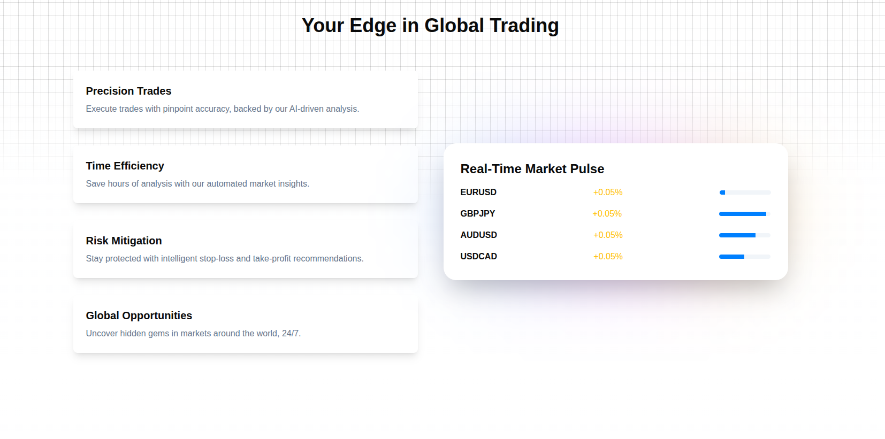
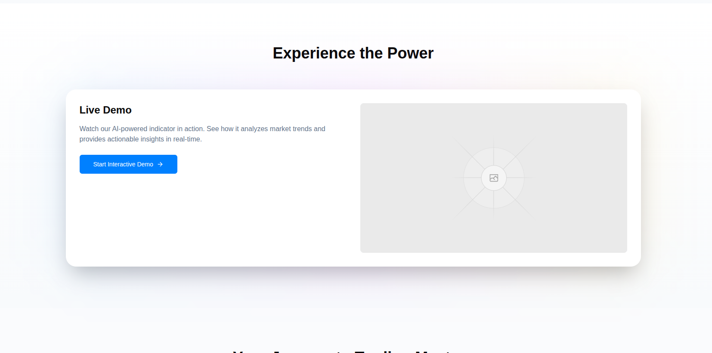

# UI Cards

A collection of 4 sleek, responsive React components built with **Next.js**, **Tailwind CSS**, and **shadcn/ui**. These cards are tailored for modern fintech or trading dashboards, showcasing gradients, interactivity, and clean layouts.

## Tech Stack

- **React (via Next.js)**
- **Tailwind CSS**
- **shadcn/ui**
- **Lucide Icons**
- **TypeScript** (minimal usage; components are JS-compatible)

## Components

### 1. `AboutCard`

A company mission section with gradient lighting and image focus.



---

### 2. `CardV1`

Feature-focused layout with simple content + data visualization.


---

### 3. `CardV2`

Grid-patterned background variant with the same feature set.



---

### 4. `CardV3`

A live demo call-to-action card with interactive intent.



---

## 🛠 Usage

You can drop any of these components into your Next.js + Tailwind project. They assume `shadcn/ui` setup and use components like `<Button />`.

To install shadcn/ui and Lucide:

```bash
npm install @shadcn/ui lucide-react
